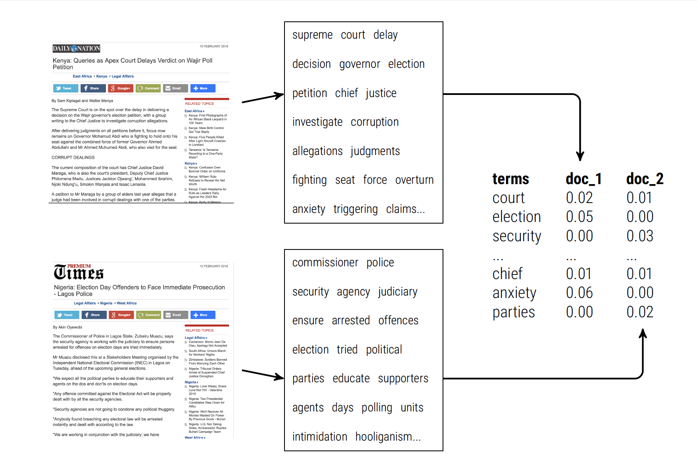
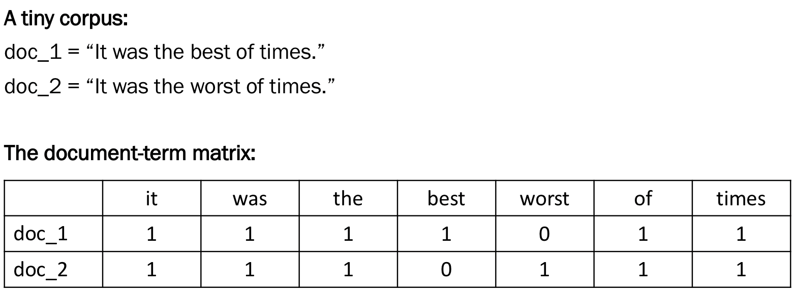
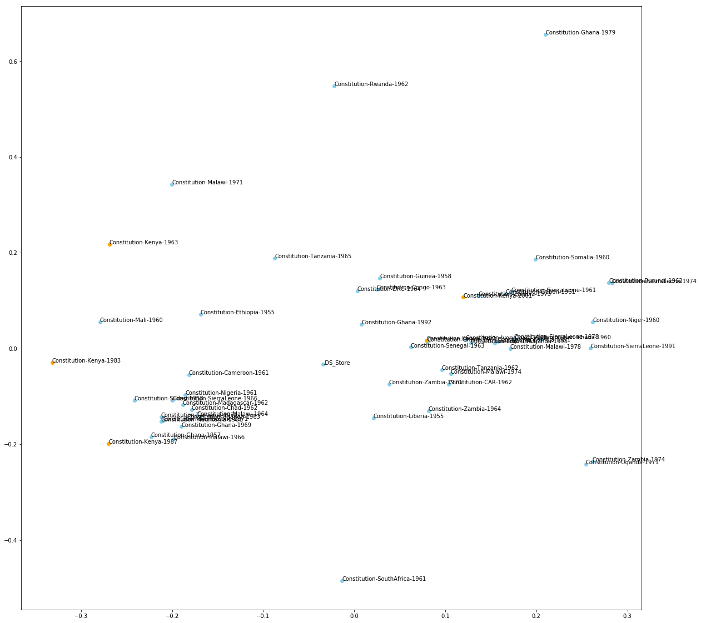
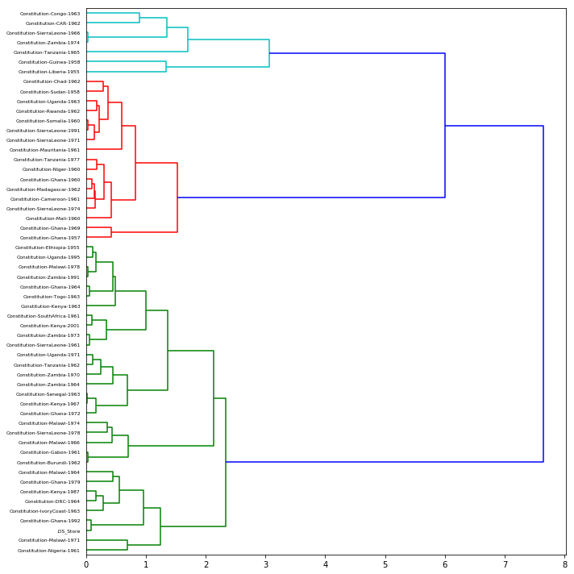

# Vectorizing Texts

This tutorial explains:

- how to create a document-term matrix

- ways of measuring distances between texts

- how to visualize differences or similarities between texts

---

When computers "read" texts, they aren't reading them the same way that humans do. Computers are actually interpreting texts as [string bits](https://groups.csail.mit.edu/mac/ftpdir/scheme-7.4/doc-html/scheme_10.html). This information provides the computer with instructions for displaying text, sound, or images, but this doesn't mean a computer literally understands the _meaning_ or _content_ of these data---at least not in the same way that humans do.

A key task of any computational text analysis is first finding a way to convert the complexity of human language into terms that a computer can actually understand. This is what **natural language processing** means: converting human language to computer language such that the computer reads texts like a human would.

To this end, natural language processing involves transforming texts into vectors (or matrices). Vectors are objects that lend themselves to a variety of computational operations in Python, making them an ideal data structure for running computational text analysis. Remember that text vectors are just quantitative representations of qualitative information---it's a translation of our texts into a format that our computer is able to read. 

We can visualize this as a 3-step process:

*Converting Texts to Vectors* 

---

Full disclosure: Computers need A LOT of help interpreting text as data. Trust me when I say that the **vast majority** of time that you spend on text analysis will be devoted to converting or "cleaning" your texts in **preparation** for analysis. We call this the "pre-processing" stage. It is a long stage.

---


Let's get started by importing a corpus of autocratic [constitutions](https://github.com/fionashenbayh/digital_dictatorship/tree/master/Constitutions). In particular, this corpus includes constitutions for postcolonial African one-party regimes.


```python
import os
import nltk


from nltk.corpus import CategorizedPlaintextCorpusReader
corpus_root = "/your_corpus_root/"
constitutions = CategorizedPlaintextCorpusReader(corpus_root, 
                                             fileids=r'Constitution-(\w+)-\d{4}\.txt',  #regular expressions
                                             cat_pattern=r'Constitution-(\w+)-\d{4}\.txt',
                                             encoding='latin-1')


constitutions.abspaths()

filepath = '/your_file_path/'

filename = [file for file in os.listdir(corpus_root)]

filename
```


    ['Constitution-Kenya-1983.txt',
     'Constitution-Ghana-1957.txt',
     'Constitution-Sudan-1958.txt',
     'Constitution-Chad-1962.txt',
     'Constitution-Madagascar-1962.txt',
     'Constitution-Cameroon-1961.txt',
     'Constitution-Mali-1960.txt',
     'Constitution-Ghana-1969.txt',
     'Constitution-Rwanda-1962.txt',
     'Constitution-Liberia-1955.txt',
     'Constitution-Ghana-1992.txt',
     'Constitution-Ghana-1979.txt',
     'Constitution-Guinea-1958.txt',
     'Constitution-DRC-1964.txt',
     'Constitution-Kenya-1987.txt',
     'Constitution-Mauritania-1961.txt',
     'Constitution-SierraLeone-1991.txt',
     'Constitution-SierraLeone-1978.txt',
     'Constitution-Uganda-1995.txt',
     'Constitution-Zambia-1991.txt',
     'Constitution-Malawi-1978.txt',
     'Constitution-Ethiopia-1955.txt',
     'Constitution-Nigeria-1961.txt',
     'Constitution-Niger-1960.txt',
     'Constitution-Malawi-1974.txt',
     'Constitution-Tanzania-1962.txt',
     'Constitution-Uganda-1971.txt',
     'Constitution-Zambia-1974.txt',
     'Constitution-SierraLeone-1966.txt',
     'Constitution-Tanzania-1977.txt',
     'Constitution-SierraLeone-1971.txt',
     'Constitution-Somalia-1960.txt',
     'Constitution-Malawi-1966.txt',
     'Constitution-Uganda-1963.txt',
     'Constitution-SierraLeone-1974.txt',
     'Constitution-Burundi-1962.txt',
     'Constitution-Gabon-1961.txt',
     'Constitution-SierraLeone-1961.txt',
     'Constitution-Zambia-1973.txt',
     'Constitution-Kenya-2001.txt',
     'Constitution-SouthAfrica-1961.txt',
     'Constitution-Tanzania-1965.txt',
     'Constitution-Malawi-1971.txt',
     'Constitution-CAR-1962.txt',
     'Constitution-Zambia-1970.txt',
     'Constitution-Zambia-1964.txt',
     'Constitution-Malawi-1964.txt',
     'Constitution-Ghana-1960.txt',
     'Constitution-Kenya-1963.txt',
     'Constitution-Congo-1963.txt',
     'Constitution-IvoryCoast-1963.txt',
     'Constitution-Togo-1963.txt',
     'Constitution-Ghana-1964.txt',
     'Constitution-Kenya-1967.txt',
     'Constitution-Senegal-1963.txt',
     'Constitution-Ghana-1972.txt']


What's an efficient way of summarizing our corpus? 

We could create a **document-term matrix** (AKA term-document matrix, depending on how you sort your rows and columns).

A document-term matrix represents the frequency of terms (words) that occur in a particular collection of documents.

- rows correspond to documents in the corpus
- documents correspond to terms 

(Note: for a term-document matrix, the order is reversed)

Each cell in the matrix represents a measure of how many times a particular word (column) appears in a particular document (row). This measure might be a simple term count or a weighted average (usually weighted by the total number of terms).

To get an intuition behind this set-up, look at the following example:



Notice above that the dimensions of the matrix are the number of documents (rows) by the total number of unique terms (columns). The number of columns of a document-term matrix is thus the length of the **corpus vocabulary.**

Is this a reasonable way to summarize a corpus of texts? Perhaps. The answer to this question ultimately depends on your research question, that is, what kind of information are you trying to analyze in the texts? For now, we'll take for granted that representing a corpus as a matrix is reasonable based on the [bag of words](https://en.wikipedia.org/wiki/Bag-of-words_model) assumption.

## Creating the document-term matrix

There are lots of existing packages that will generate a document-term matrix for you. We will be working with the [CountVectorizer](http://scikit-learn.sourceforge.net/dev/modules/generated/sklearn.feature_extraction.text.CountVectorizer.html) class from the scikit-learn package.

```python
import numpy as np  # a conventional alias for numpy, this package allows us to perform array operations on our matrix

from sklearn.feature_extraction.text import CountVectorizer
```

The document-term matrix is created by invoking the CountVectorizer class, which can be customized as follows:

- <span style="color:blue"> **encoding** </span> : ‘utf-8’ by default
- <span style="color:blue"> **lowercase** </span> : (default <span style="color:green"> **True** </span> ) convert all text to lowercase before tokenizing
- <span style="color:blue"> **stop_words** </span> : custom list of “stop words”, if ‘english’, a built-in stop word list for English is used
- <span style="color:blue"> **mind_df** </span> : (default <span style="color:green"> __1__ </span> ) remove terms from the vocabulary that occur in fewer than <span style="color:green"> **min_df** </span> documents (in a large corpus this may be set to <span style="color:green"> **15** </span> or higher to eliminate very rare words)
- <span style="color:blue"> **vocabulary** </span> :  ignore words that do not appear in the provided list of words
- <span style="color:blue"> **strip_accents** </span> : remove accents
- <span style="color:blue"> **token_pattern** </span> : (default <span style="color:green"> **u'(?u)\b\w\w+\b'** </span> ) regular expression identifying tokens. By default, words that consist of a single character (e.g., ‘a’, ‘2’) are ignored, setting token_pattern to '(?u)\b\w+\b' will include these tokens
- <span style="color:blue"> **tokenizer** </span> : (default unused) use a custom function for tokenizing
- <span style="color:blue"> **decode_error** </span> : (default <span style="color:green"> **strict** </span>) : Instruction on what to do if a byte sequence is given to analyze that contains characters not of the given encoding; by default, it is ‘strict’, meaning that a UnicodeDecodeError will be raised, but other values are ‘ignore’ and ‘replace’


```python
vectorizer = CountVectorizer(input='filename', 
                             encoding= 'ISO-8859-1',
                             stop_words='english',
                             min_df = 10,
                             decode_error='ignore')

dtm = vectorizer.fit_transform(raw_documents=constitutions.abspaths())  # .abspaths() provides the absolute filepath to every document in our corpus

vocab = vectorizer.get_feature_names()  # a list
```

And that's it! We now have a document-term matrix `dtm` and a vocabulary list `vocab`! 

Let's take a look at what we have created, starting with its dimensions. What do you notice about the dimensions of this matrix?

```python
dtm.shape 
```


    (56, 2564)


And what do you notice about the length of the vocab?

```python
type(vocab), len(vocab)
```


    (list, 2564)


```python
vocab
```


    ['able',
     'abolish',
     'abolished',
     'abolition',
     'abroad',
     'absence',
     'absent',
     'absolute',
     'ac',
     'accepted',
     'accepts',
     ...]


Try re-running `CountVectorizer` using different values for **min_df**. How does this change the size of dtm and the vocab? Is it sensitive or unsensitive to small changes?

A cusory glance at the vocabulary reveals that many of the strings included as terms are just numbers. Do you want to keep these numbers in your analysis? If not, how would you adjust the CountVectorizer function to remove them?

We can use [regular expressions](https://www.regular-expressions.info/) with `token_pattern`.


```python
vectorizer = CountVectorizer(input='filename', 
                             encoding= 'ISO-8859-1',
                             stop_words='english',
                             min_df = 15,
                             decode_error='ignore', 
                            token_pattern=r'\b[^\d\W]+\b') # regular expression to capture non-digit words

dtm = vectorizer.fit_transform(raw_documents=constitutions.abspaths())  # .abspaths() provides the absolute filepath to every document in our corpus

vocab = vectorizer.get_feature_names()  # a list
```


```python
dtm.shape
```


    (56, 1887)


## A Sparse Matrix

What does our dtm actually look like? Let's take a peek.

```python
dtm
print(dtm)
```

      (0, 1187)	1
      (0, 2162)	1
      (0, 1962)	1
      (0, 1006)	1
      (0, 27)	1
      (0, 2129)	1
      (0, 582)	1
      (0, 2116)	1
      (0, 2017)	1
      (0, 1134)	1
      (0, 782)	1
      (0, 365)	1
      (0, 1521)	1
      (0, 1680)	1
      (0, 1388)	1
      (0, 1673)	1
      (0, 1045)	1
      (0, 194)	1
      (0, 1004)	1
      (0, 26)	1
      (0, 2331)	1
      (0, 196)	1
      (0, 25)	1
      (0, 1641)	1
      (0, 2095)	1
      :	:
      (55, 397)	233
      (55, 1583)	186
      (55, 2451)	3
      (55, 796)	26
      (55, 2454)	2
      (55, 827)	7
      (55, 1326)	4
      (55, 767)	1
      (55, 2244)	3
      (55, 947)	2
      (55, 1728)	1
      (55, 2135)	23
      (55, 1182)	3
      (55, 1232)	19
      (55, 1741)	289
      (55, 1259)	2
      (55, 874)	2
      (55, 736)	6
      (55, 469)	4
      (55, 593)	5
      (55, 1804)	6
      (55, 1391)	4
      (55, 1405)	1
      (55, 1419)	1
      (55, 697)	194


What do all of these numbers mean? Where did all of the terms from our vocabulary go?  

All of our vocabulary terms are actually represented here. But what we're looking at is a special type of matrix object: a sparse matrix.


```python
dtm
```


    <56x2564 sparse matrix of type '<class 'numpy.int64'>'
    	with 67197 stored elements in Compressed Sparse Row format>


### What is a sparse matrix and why is this what CountVectorizer returns?

To answer this question, we have to think about how much information is actually contained in a document-term matrix. Most document-term matrices have a lot of zero values (empty cells). Why? Remember that the columns of a dtm represent the unique vocab terms _across the entire corpus_; it is highly unlikely that every document in the corpus uses exactly the same terms. And whenever a term isn't present in a document, there will be a zero entry. 

Now think about how your computer handles data. Imagine you have a document-term matrix with hundreds or thousands of elements and only a few of those elements contain non-zero values. We could try to look at the full matrix with all of its zero *and* nonzero entries (**dense matrix**), there are much more efficient methods of dealing with such data. And efficiency means our computer reads faster.

A **sparse matrix** is one that only records **non-zero entries**, which is much more efficient in terms of memory and computing time. This is why CountVectorizer returns a sparse matrix by default.

Let's look at our dtm again. 


```python
print(dtm) # this is what the sparse matrix looks like
```

      (0, 1187)	1
      (0, 2162)	1
      (0, 1962)	1
      (0, 1006)	1
      (0, 27)	1
      (0, 2129)	1
      (0, 582)	1
      (0, 2116)	1
      (0, 2017)	1
      (0, 1134)	1
      (0, 782)	1
      (0, 365)	1
      (0, 1521)	1
      (0, 1680)	1
      (0, 1388)	1
      (0, 1673)	1
      (0, 1045)	1
      (0, 194)	1
      (0, 1004)	1
      (0, 26)	1
      (0, 2331)	1
      (0, 196)	1
      (0, 25)	1
      (0, 1641)	1
      (0, 2095)	1
      :	:
      (55, 397)	233
      (55, 1583)	186
      (55, 2451)	3
      (55, 796)	26
      (55, 2454)	2
      (55, 827)	7
      (55, 1326)	4
      (55, 767)	1
      (55, 2244)	3
      (55, 947)	2
      (55, 1728)	1
      (55, 2135)	23
      (55, 1182)	3
      (55, 1232)	19
      (55, 1741)	289
      (55, 1259)	2
      (55, 874)	2
      (55, 736)	6
      (55, 469)	4
      (55, 593)	5
      (55, 1804)	6
      (55, 1391)	4
      (55, 1405)	1
      (55, 1419)	1
      (55, 697)	194

Looking at this dtm object, we can see how a sparse matrix is structured: there are two arrays printed above; the first array points to the index of a non-zero entry (i.e. the row, column location of the term), and the second array contains the value of that non-zero entry (i.e. the term count). 


### Coverting to numpy array

Before we keep going, let's convert our sparse matrix `dtm` into a NumPy array object. Let's also convert our vocabulary object `vocab` into a NumPy array. 

We do this for convenience: array objects support more operations than matrices and lists.


```python
dtm = dtm.toarray()  # convert to a regular array
vocab = np.array(vocab)
```


```python
type(dtm) # note the new type
```


    numpy.ndarray


```python
print(dtm) # is this a sparse or dense matrix?

dtm.shape
```

    [[  1   0   1 ...   4   0   0]
     [  0   0   0 ...   2   3   0]
     [  0   0   0 ...   6   0   0]
     ...
     [  1   1   2 ...  34   1 147]
     [  1   1   2 ...  35   1 140]
     [  1   2   2 ...  29   0  70]]


    (56, 1887)


```python
print(vocab)
```

    ['able' 'abolish' 'abolished' ... 'years' 'youth' 'â']


## What can we do with a Document-Term Matrix?

Arranging our texts as a document-term matrix allows us to do a lot of comparative analysis using computational techniques.

For example, we can now more easily measure whether two documents are _similar_ or _different_.

But how do we actuallly go about measuring this? Merely saying something is "similar/different" is a qualitative statement. But the document-term matrix is a quantitative representation of the documents in our corpus, meaning we can actually derive a quantitative measure of how similar or different texts are within the matrix.

### Euclidean Distance

One popular distance metric is Euclidean distance, which is calculated using Cartesian coordinates and the Pythagorean theorem. In short, the Euclidean distance between two vectors is simply the length of the hypotenuse that joins the two vectors. 

#Even if we're not dealing with two-dimensional vectors (we aren't usually dealing with two-word corpora), the basic intuition for calculating the Euclidean distances between longer vectors is the same. This means we can calculate the pairwise distances between each document in our corpus. 

Fortunately Scikit-Learn already has a built-in function for this.


```python
from sklearn.metrics.pairwise import euclidean_distances

dist = euclidean_distances(dtm)
```


```python
dist

np.round(dist, 0) # easier to print output if we round to the nearest integer
```


    array([[   0.,  155.,  154., ..., 1117., 1115.,  917.],
           [ 155.,    0.,  122., ..., 1133., 1130.,  928.],
           [ 154.,  122.,    0., ..., 1094., 1091.,  892.],
           ...,
           [1117., 1133., 1094., ...,    0.,   54.,  320.],
           [1115., 1130., 1091., ...,   54.,    0.,  314.],
           [ 917.,  928.,  892., ...,  320.,  314.,    0.]])


```python
dist.shape # what do the dimensions of this array represent?
```


    (56, 56)


```python
filenames[1], filenames[2], filenames[3], filenames[4] #remind ourselves of which text is which
```


    ('Constitution-Ghana-1957.txt',
     'Constitution-Sudan-1958.txt',
     'Constitution-Chad-1962.txt',
     'Constitution-Madagascar-1962.txt')


```python
dist[1, 2]

# np.round(dist[1, 2], 0)
```


    0.13495388486992588


```python
dist[1, 3] > dist[3, 4]
```


    True


### Cosine Similarity

Another popular measure of comparison is cosine similarity. Many people prefer cosine similarity to Euclidean distance because the latter is sensitive to the length of texts (i.e. since the length of texts is probably going to increase the size of the vocabulary, which means you've got longer vectors and thus longer hypotheneuses). 

Cosine similarity, by contrast, isn't sensitive to the length of texts because it's just calculating the cosine of the angle between two vectors.

Cosine similarity ranges between 0 and 1:

- cos(&theta;) = 1: two vectors have the same orientation, i.e. texts are identical 
- cos(&theta;) = -1: two vectors have opposite oritentation, i.e. texts are exact opposites
- cos(&theta;) = -0: Two vectors with orthogonol orientation, i.e. texts are completely independent


```python
from sklearn.metrics.pairwise import cosine_similarity

dist = cosine_similarity(dtm)

np.round(dist, 2)
```


    array([[0.  , 1.  , 1.  , 1.  ],
           [1.  , 0.  , 1.  , 1.  ],
           [1.  , 1.  , 0.  , 0.85],
           [1.  , 1.  , 0.85, 0.  ]])


```python
dist[1, 2]
```


    0.13495388486992588


```python
dist[1, 3] > dist[3, 4]
```


    True


### Visualizing Distances

Once we vectorize our texts, we can plot them in vector space. Doing so let's us **visualize distances** between texts. 

The problem is a text vector could have hundreds, thousands, or even more dimensions (think of the length of the vector).

We shouldn't even try to plot these huge, multi-dimensional vectors (the point of visualizing data is to make it more legible, not less!). But what we can do is reshape these huge vectors into more easily plotted objects.

This is called **multidimensional scaling (MDS)**. MDS essentially transforms the information about the pairwise 'distances' among a corpus of $n$ texts into a configuration of $n$ points that can be mapped into an abstract Cartesian space.

In other words, we want to assign a 2-dimensional point to each text in our corpus, while making sure that the distance between each of these points is proportional to the pairwise distances between each text.

Thankfully there are pre-built MDS functions in Scikit-learn.


```python
import os 
import matplotlib.pyplot as plt
from sklearn.manifold import MDS
```

In the MDS function:

- n_components refers to the dimensions of our plotted plane (2-D)
- dissimilarity refers to the distance/similarity measure we want to use, "euclidean" by default, "precomputed" inputs a dissimilarity matrix


```python
mds = MDS(n_components=2, dissimilarity="precomputed", random_state=1)

pos = mds.fit_transform(dist)  # shape (n_components, n_samples)
```


```python
xs, ys = pos[:, 0], pos[:, 1]

# store shortened version of filenames to list for plotting 
names = [os.path.basename(fn).replace('.txt', '') for fn in filenames]

plt.figure(figsize=(20, 20))

for x, y, name in zip(xs, ys, names):
    color = 'orange' if "Kenya" in name else 'skyblue'
    plt.scatter(x, y, c=color, )
    plt.text(x, y, name)

plt.show()

```


   
    


## What does this plot actually show us? 

In the plotted figure above, we have created a visual representation of the pairwise distance between texts (where distance is represented by X and Y coordinates in a 2-dimensional plane). 

Let's look at the values on the X and the Y axis. These coordinates are not substantively meaningful: e.g. that the 1961 South African Constitution has a coordinate value of (0.01, -0.45) doesn't tell us anything useful about the South African Constitution. 

Rather, what we care about here is the **distance between** the 1961 South African Constitution and any other constitution on this plane, like the 1955 Constitution from Liberia or the 1964 Constitution from Zambia. 

What this plot shows is that the South African Constitution is **more similar** to the 1955 Liberian Constitution than the 1964 Zambian Constitution.

So it is the **distance between coordinate values** -- rather than the coordinate values themselves -- which provide substantive meaning.

---

## Clustering texts based on distance

One way to explore the corpus is to cluster texts into discrete groups of similar texts.


One strategy for clustering is called Ward’s method that produces a hierarchy of clusterings. Ward’s method begins with a set of pairwise distance measurements–such as those we calculated a moment ago. The clustering method is as follows :

1. At the start, treat each data point as one cluster. The number of clusters at the start will be K, while K is an integer representing the number of data points.
2. Form a cluster by joining the two closest data points resulting in K-1 clusters.
3. Form more clusters by joining the two closest clusters resulting in K-2 clusters.
4. Repeat the above three steps until one big cluster is formed.
5. Once single cluster is formed, dendrograms (tree diagrams) are used to divide into multiple clusters depending upon the problem. 

The function scipy.cluster.hierarchy.ward performs this algorithm and returns a tree of cluster-merges. The hierarchy of clusters can be visualized using scipy.cluster.hierarchy.dendrogram.


```python
from scipy.cluster.hierarchy import ward, dendrogram
```


```python
linkage_matrix = ward(dist)

dendrogram(linkage_matrix, orientation="right", labels=names)

plt.tight_layout()
plt.show()
```





# Exercises

1. Using the strings below as documents and using CountVectorizer with the input='content' parameter, create a document-term matrix. Apart from the input parameter, use the default settings.


```python
text1 = "The Fake News is saying that I am willing to meet with Iran, “No Conditions.” That is an incorrect statement (as usual!)."
text2 = "Here we go again with General Motors and the United Auto Workers. Get together and make a deal!"
text3 = "Saudi Arabia oil supply was attacked. There is reason to believe that we know the culprit, are locked and loaded depending on verification, but are waiting to hear from the Kingdom as to who they believe was the cause of this attack, and under what terms we would proceed!"
text4 = "PLENTY OF OIL!"
```


```python
vectorizer = CountVectorizer(input = 'content',
                            encoding= 'ISO-8859-1',
                             stop_words='english',
                             min_df = 1,
                             decode_error='ignore')

dtm = vectorizer.fit_transform([text1, text2, text3, text4])  # .abspaths() provides the absolute filepath to every document in our corpus

vocab = vectorizer.get_feature_names()  # a list
```


```python
dtm.shape
```


    (4, 38)


2. Using the document-term matrix just created, calculate the Euclidean distance and cosine distance between each pair of documents. Make sure to calculate distance (rather than similarity). Are our intuitions about which texts are most similar reflected in the measurements of distance?

